
<h1 align="center">网络在线考试系统</h1>

## 简介
网络在线考试系统：角色分为管理员、用户；功能包括试卷管理、考试记录查看、题库管理、错题分析、公告管理，支持在线答题、用户管理、信息发布与编辑。    --计算机毕业设计源码；毕设源码；java毕业设计源码

## 联系方式

<h3 align="center">获取完整代码与数据库文件 + 微信：deepguan QQ: 86050149 QQ群: 783742310</h3>

<h3 align="center">可帮忙远程部署 包运行成功！提供远程部署、修改代码、设计文档指导、代码讲解等服务！</h3>

## 功能介绍（完整见运行截图）
管理员： 管理员信息管理功能包括添加、修改和删除管理员账号，管理用户信息和考试数据，覆盖了用户管理、试卷管理、公告管理和题目管理模块。管理员可以通过导航栏访问不同管理模块，执行查询、批量删除等操作，以维持系统的高效运行和数据安全。还具备发布和编辑公告、管理公告类型、以及处理错题记录等功能，通过这些功能管理员可以全面掌控系统的日常运作。

用户： 用户可以通过简洁的考试界面参与各类考试，支持题目导航、计时功能以及答案提交。用户能查看标注做答状态的题号面板，确保不遗漏答题。除此之外，用户还可以在考试记录页面查看自己的历史成绩和详细答题信息。系统的设计旨在提供流畅的考试体验，通过个人中心功能，用户能够管理自己的账户信息，同时参与论坛讨论和查看公告，获得更多学习和考试相关信息。

## 运行截图
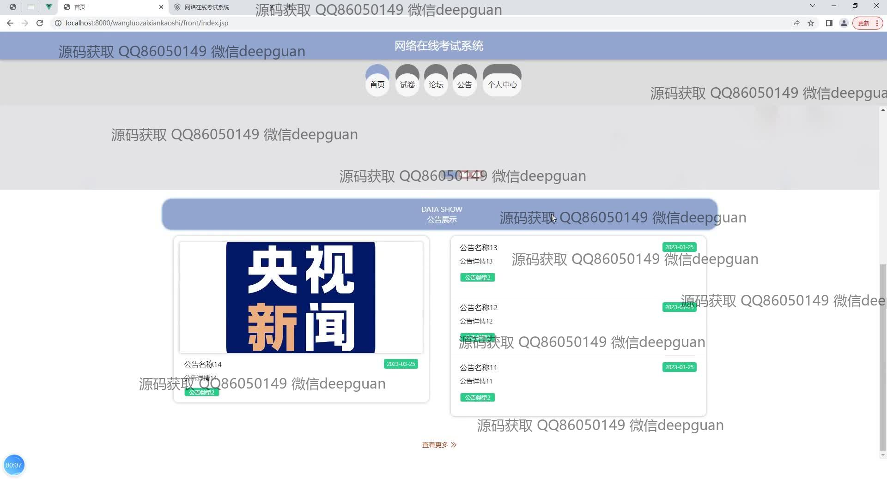
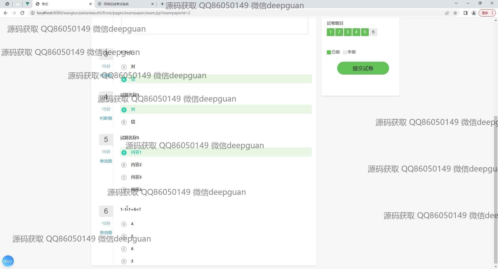
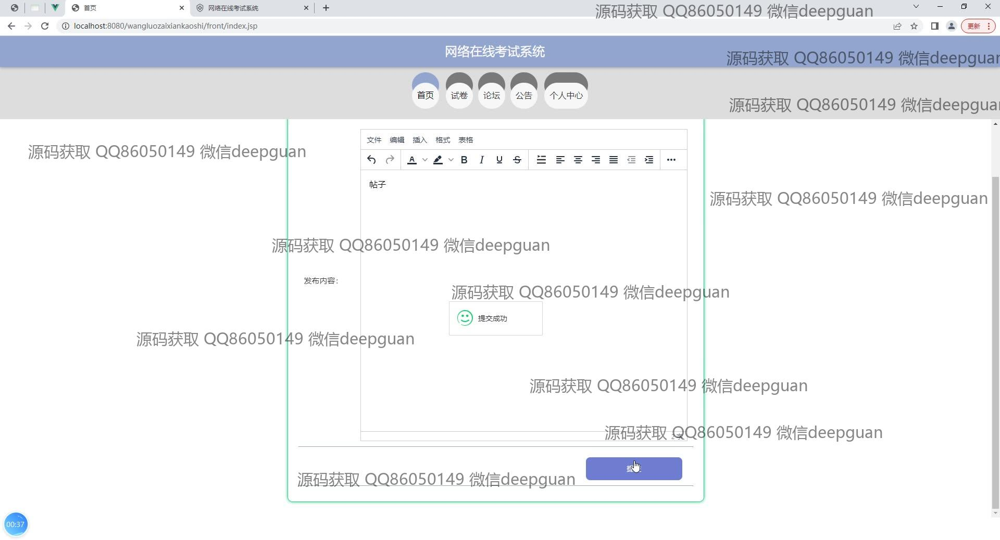
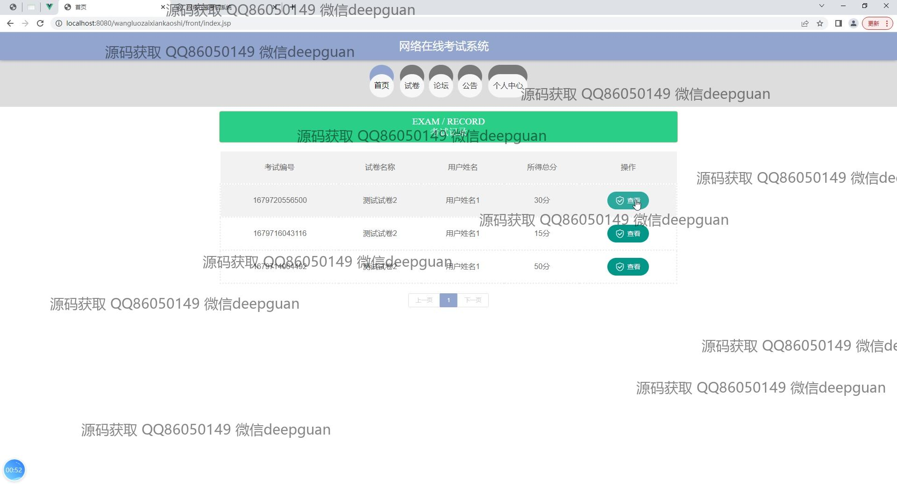
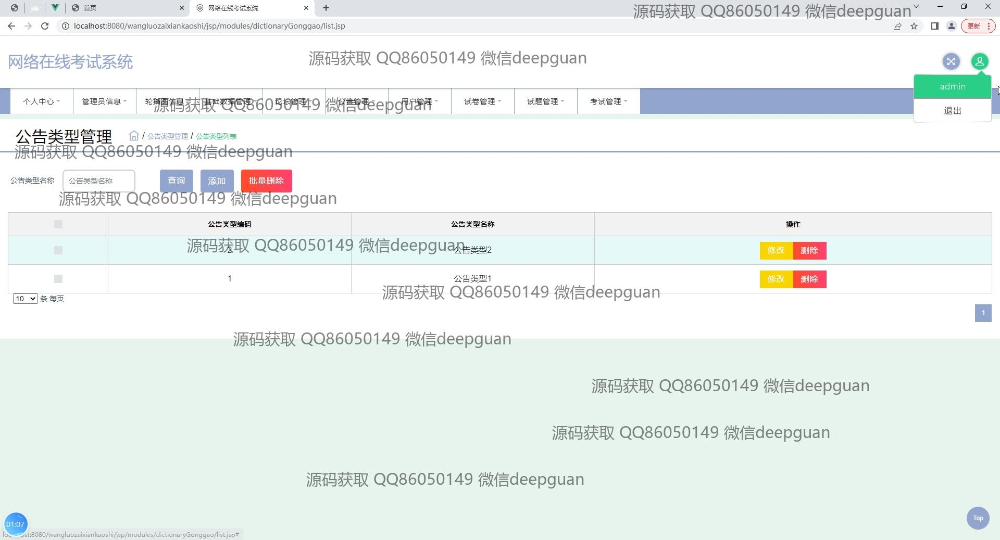
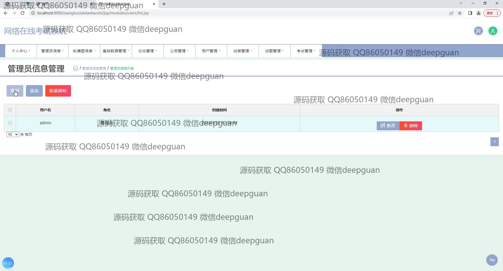
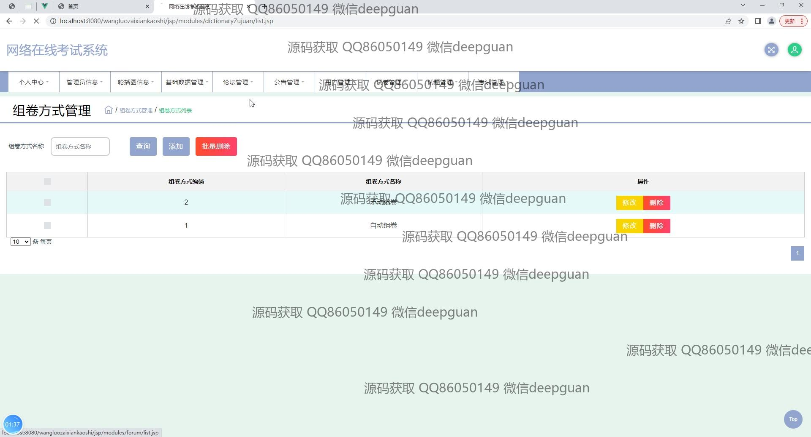
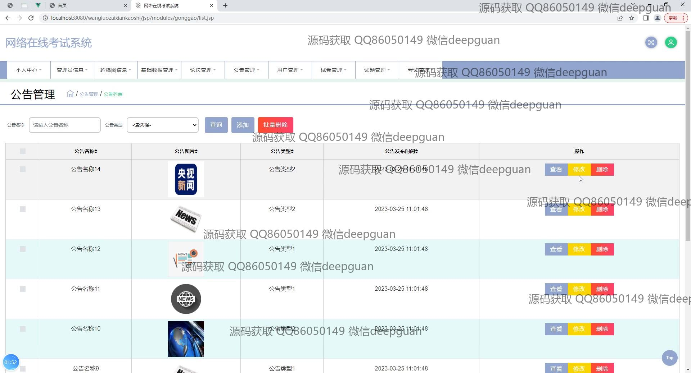
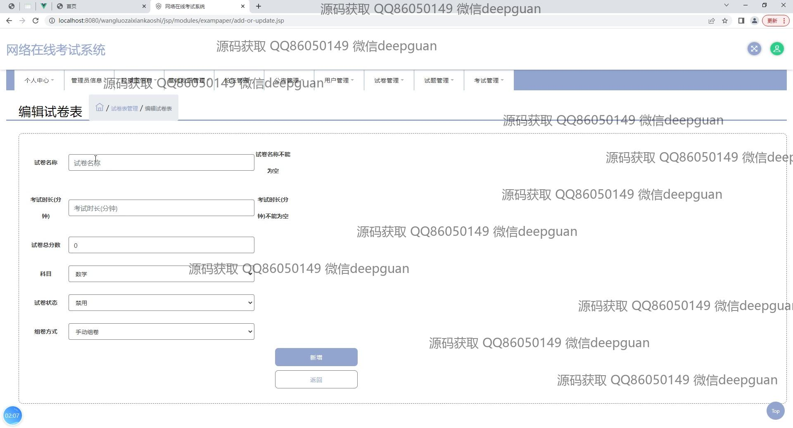
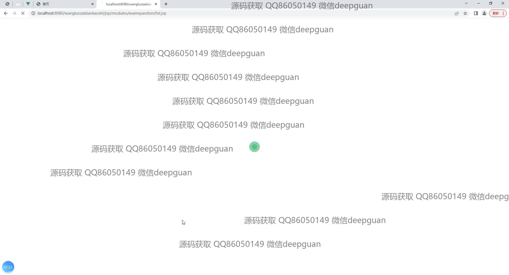
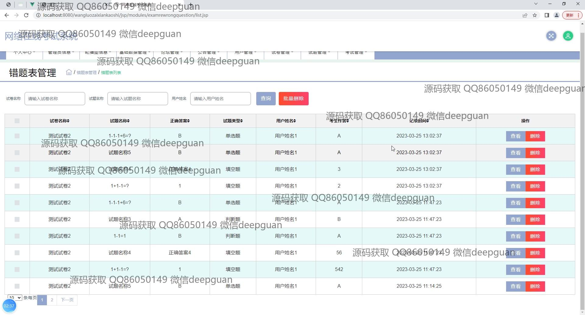

本代码来源于网络,仅供学习参考使用!

